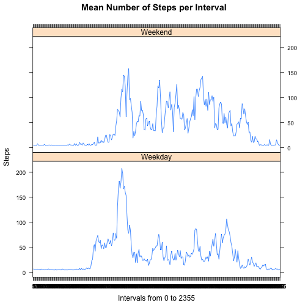

## Introduction 
This project presents a cursory analysis of some "quantified self" data for the first assignment in the Reproducible Research course in the Coursera Data Science Specialization. 

The data come for a personal activity monitoring device that collects data at 5-minute intervals. Two months worth of data consisting of the number of steps taken in these 5-minute intervals are presented. There are 17,568 observations with 3 variables: steps, date and interval.

Initially, we download and inspect the data.

## Loading and Preparing the Data for Exploratory Analysis


```r
require(downloader); require(Hmisc); require(plyr); require(lattice)
data_url <- "https://d396qusza40orc.cloudfront.net/repdata%2Fdata%2Factivity.zip"
download(data_url, dest = "data.zip", mode = "wb")
unzip("data.zip", exdir = "./")
data = read.csv("activity.csv", stringsAsFactors = FALSE)
data$date <- as.Date(as.character(data$date))
data$interval <-as.factor(data$interval)
summary(data)
```

```
##      steps             date               interval    
##  Min.   :  0.00   Min.   :2012-10-01   0      :   61  
##  1st Qu.:  0.00   1st Qu.:2012-10-16   5      :   61  
##  Median :  0.00   Median :2012-10-31   10     :   61  
##  Mean   : 37.38   Mean   :2012-10-31   15     :   61  
##  3rd Qu.: 12.00   3rd Qu.:2012-11-15   20     :   61  
##  Max.   :806.00   Max.   :2012-11-30   25     :   61  
##  NA's   :2304                          (Other):17202
```

## First question: What is mean total number of steps taken per day?

For this portion of the analysis, we loop over the steps variable with "tapply" to calculate the mean number of steps per day. We then portray this in a histogram. Finally, we use the "summary" function to retrieve the median and mean 


```r
stepday <- tapply(data$steps, data$date, mean)
print(stepday)
```

```
## 2012-10-01 2012-10-02 2012-10-03 2012-10-04 2012-10-05 2012-10-06 
##         NA  0.4375000 39.4166667 42.0694444 46.1597222 53.5416667 
## 2012-10-07 2012-10-08 2012-10-09 2012-10-10 2012-10-11 2012-10-12 
## 38.2465278         NA 44.4826389 34.3750000 35.7777778 60.3541667 
## 2012-10-13 2012-10-14 2012-10-15 2012-10-16 2012-10-17 2012-10-18 
## 43.1458333 52.4236111 35.2048611 52.3750000 46.7083333 34.9166667 
## 2012-10-19 2012-10-20 2012-10-21 2012-10-22 2012-10-23 2012-10-24 
## 41.0729167 36.0937500 30.6284722 46.7361111 30.9652778 29.0104167 
## 2012-10-25 2012-10-26 2012-10-27 2012-10-28 2012-10-29 2012-10-30 
##  8.6527778 23.5347222 35.1354167 39.7847222 17.4236111 34.0937500 
## 2012-10-31 2012-11-01 2012-11-02 2012-11-03 2012-11-04 2012-11-05 
## 53.5208333         NA 36.8055556 36.7048611         NA 36.2465278 
## 2012-11-06 2012-11-07 2012-11-08 2012-11-09 2012-11-10 2012-11-11 
## 28.9375000 44.7326389 11.1770833         NA         NA 43.7777778 
## 2012-11-12 2012-11-13 2012-11-14 2012-11-15 2012-11-16 2012-11-17 
## 37.3784722 25.4722222         NA  0.1423611 18.8923611 49.7881944 
## 2012-11-18 2012-11-19 2012-11-20 2012-11-21 2012-11-22 2012-11-23 
## 52.4652778 30.6979167 15.5277778 44.3993056 70.9270833 73.5902778 
## 2012-11-24 2012-11-25 2012-11-26 2012-11-27 2012-11-28 2012-11-29 
## 50.2708333 41.0902778 38.7569444 47.3819444 35.3576389 24.4687500 
## 2012-11-30 
##         NA
```

```r
hist(stepday, main = "Total Number of Steps / Day", xlab = "Mean number of steps")
```

 

```r
summary(stepday)
```

```
##    Min. 1st Qu.  Median    Mean 3rd Qu.    Max.    NA's 
##  0.1424 30.7000 37.3800 37.3800 46.1600 73.5900       8
```

## Second question: What is the average daily activity pattern?

The second portion performs a similar analysis, but over intervals instead of days. Here we use the "aggregate" function to average steps over intervals. We then plot this using a basic time series plot and query the created object created to find the interval with the highest mean number of steps. The maximum mean steps per interval occurs at interval 835, which is the 104th interval.


```r
stepint <- aggregate( data$steps ~ data$interval, FUN = mean )
plot(stepint, xlab = "Intervals from 0 to 2355", ylab = "Steps", type = "l", main = "Mean Number of Steps by Interval")
```

 

```r
maxstepsint <- tapply(data$steps, data$interval, na.rm = TRUE, mean)
which.max(maxstepsint)
```

```
## 835 
## 104
```


## Third question: Imputing missing values

The third analysis asks us to first compute the number of NAs in the data set. We then replace these values with the mean steps value in a new data frame using the "impute" function from the Hmisc package. To analyze the combined data, we create a new data frame that includes the imputed missing values with the rest ofthe data. 

We then loop through the vector with the imputed missing values to calculate the mean number of steps per day. In order to see the effect of imputation, we report the mean and median values of the vector with NAs vs. the vector with imputed missing values. Notice that the mean is identical, which is to be expected given that the imputed values were equal to the vector's mean, but the medians are different.

We then plot this as a histogram alongside the histogram without the imputed values to more clearly see the effect of missing data imputation on the two distributions.


```r
length(which(is.na(data[1]==T)))
```

```
## [1] 2304
```

```r
df.imp <- with(data, impute(data$steps, mean))
df.new <-data.frame(data$steps,data$date,data$interval,df.imp)
stepday2 <- tapply(df.new$df.imp, df.new$data.date, mean)
mean(stepday, na.rm = TRUE); median(stepday, na.rm = TRUE)
```

```
## [1] 37.3826
```

```
## [1] 37.37847
```

```r
mean(stepday2); median(stepday2)
```

```
## [1] 37.3826
```

```
## [1] 37.3826
```

```r
#create plots
par(mfrow=c(1,2))
hist(stepday, main = "Total Number of Steps / Day", xlab = "Mean number of steps")
hist(stepday2, main = "Imputation of NAs", xlab = "Mean number of steps")
```

 


## Fourth question: Are there differences in activity patterns between weekdays and weekends?

The fourth and final analysis asks us to use the "weekdays" function to make a panel plot depicting the changes in the "steps" variable from weekdays to weekends. 

To do so, we first use the "weekdays" function to determine whether dates are weekdays or weekend days. We then group days using the "revalue" function, transform that vector into class "factor" and, finally, aggregate mean step values over intervals and weekdays vs. weekend days. 


```r
wkdays <-weekdays(df.new$data.date)
df.new$wkdays <- revalue(wkdays, c(Monday = "Weekday", Tuesday = "Weekday", Wednesday = "Weekday", Thursday = "Weekday", Friday = "Weekday", Saturday = "Weekend", Sunday = "Weekend"))
df.new$wkdays <-as.factor(df.new$wkdays)
stepint <-aggregate(df.imp ~ data.interval + wkdays, data = df.new, mean)
xyplot(df.imp ~ data.interval | wkdays, stepint, type = "l", layout = c(1, 2), xlab = "Intervals from 0 to 2355", ylab = "Steps", main = "Mean Number of Steps per Interval")
```

 
